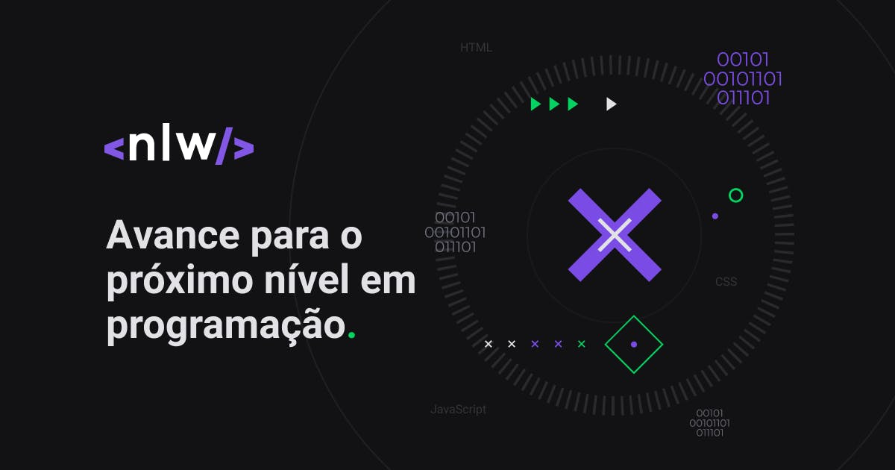

<h1 align="center">
  
</h1>

 

## 📖 Sobre NLW
A [NLW (Next Level Week)](https://nextlevelweek.com/) é um evento feito pela [Rocketseat](https://rocketseat.com.br/) que dura uma semana. Nessa edição o evento foi dividido em 3 trilhas, React, NodeJS e Elixir.

## Trilhas no qual participei
Consegui participar em 2 trilhas. Na trilha de React eu me interessei pois iriam estar abortando sobre o NextJS, essa trilha foi ministrada pelo [Diego Fernandes](https://github.com/diego3g). Já a trilha de Elixir, foi um desafio para mim, pois seria o primeiro contato com a linguagem e achei muito interessante por ela ser full funcional, trilha ministrada pelo [Rafael Camarda](https://github.com/RafaelCamarda).